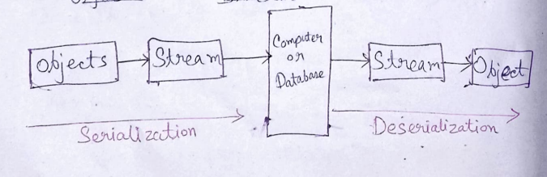

### YAML

YAML, previously known as `Yet Another Markup Language`, is now recognized as `YAML Ain't Markup Language`. It doesn't function as a programming language but serves as a standardized method for data formatting, facilitating data exchange. `YAML` closely resembles `JSON` and `XML` and is primarily a human-readable data serialization language used for representing data. It finds applications in configuration files and data interchange. Unlike programming languages, **YAML only allows data storage and doesn't execute commands**.

### Data Serialization

**Serialization involves converting a data object, often present in complex data structures, into a stream of bytes or storage that can used to transfer this data on your physical devices**.




*Note*: Object is a combination of data and methods `(data + code)`. It is basically a data storage unit.

#### Another definition of Data Serialization 

Serialization is basically a process of converting this data object which is a combination of code and data into series of bytes that saves the state of this object in a form that is easily transmittable 

### Deserialization

The reverse process of serialization is called deserialization. It involves converting the serialized data back into a data object.

### Data Serialization Languages

- YAML
- JSON
- XML

### Questions

- Why YAML is not known as markup language?
    - YAML is not known as markup language because it doesn't execute commands. It only allows data storage.

- Uses of YAML
    - YAML is used for data serialization, configuration files, and data interchange.
    - Configures files like kubernetes, docker
    - Logs, caches, etc

- Benefits
    - Human-readable
    - Easy to understand
    - It has strict syntax-indentation rules
    - Supports and is more powerful for complex data structures
    - Supports comments
    - Supports multiple data types
    - Supports data serialization and deserialization
    - Easily convertible to JSON and XML
    - Most language use YAML

- Important Points
    - YAML is case sensitive
    - YAML is whitespace sensitive
    - YAML is indentation based (use space and not tabs)
    - YAML supports comments (not multi line comments)
    - To separate blocks of code and treat them as document in YAML file, we use `---`, To mark as the end of the document, we use `...`
    - Some of the keys of the sequence will be empty and is known as sparse sequence
    - It can be collection of zero or more documents 

### Example

```yaml
# YAML Example
name: John Doe
age: 30
address: |
  1234, Park Avenue
  Suite 45
  New York
  USA
phone:
  home: 123-456-7890
  office: 098-765-4321
```